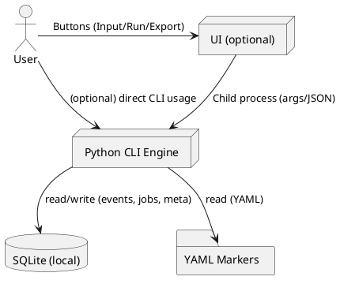

/home/dyai/Dokumente/DYAI_home/DEV/GIT_repos/Marker 5/home/dyai/Dokumente/DYAI_home/DEV/GIT_repos/Marker 5.0/Markerset_5.0/marker_engine_core.py# TransRapport (Ubuntu, LD‑3.4) · ARCHITECTURE.md

Version: 1.0
Status: Draft for Sprint 0 kickoff
Owner: Core Engineering
License: CC BY‑NC‑SA 4.0

---

## 0. Zweck & Geltungsbereich

TransRapport ist eine **lokale, offlinefähige** Anwendung zur Analyse von Gesprächstexten mit der LD‑3.4 Marker‑Pipeline (**ATO → SEM → CLU → MEMA**). Ziel ist ein **verlässliches, produktreifes** Tool ohne Mocks, das in Inkrementen lieferbar ist und nach jedem Sprint sichtbare Mehrwerte erzeugt.

**Nicht‑Ziele:** Cloud‑Abhängigkeiten, HTTP‑Dev‑Server, verdeckte Telemetrie, serverseitiges Hosting.

---

## 1. Leitprinzipien (/plan)

* **Engine:** Lokale **Python‑CLI** als Referenz‑Runtime (keine Netzwerkaufrufe).
* **UI (optional):** Tauri + Vite mit **minimalen Libraries**. So viel wie möglich **vanilla HTML/CSS/JS**.
* **Persistenz:** **SQLite** lokal. Keine Uploads. Marker‑Definitionen liegen als **YAML auf Disk**.
* **Schnittstelle:** UI ruft die Engine über **Child‑Process / Unix Domain Socket** auf, **nie** über HTTP/localhost.
* **Datenschutz:** Audio, Transkripte, Events bleiben lokal. Exporte lokal.
* **CI:** Harte Schema‑Regeln (≥5 Examples, exakt 1 Strukturblock, **SEM≥2 ATO**) blockieren Merges.

---

## 2. Systemkontext

* **Akteure:** Nutzer\:in (Therapeut\:in/Analyst\:in), lokales System (Laptop/Ubuntu), optionales UI.
* **Eingaben:** Textdateien, Transkripte (optional aus Audio), UI‑Formulareingaben.
* **Ausgaben:** Events (ATO/SEM/CLU/MEMA), Statistiken, Exporte (JSONL/CSV/TXT).



---

## 3. Komponenten

1. **CLI‑Fassade (`me`)**: Subcommands für Laden/Validieren/Jobs/Run/View/Export/Reset.
2. **Loader**: liest YAML‑Marker von Disk, prüft Präfixe, Checksums, Schema‑Version.
3. **Validator**: Regeln erzwingen: `examples ≥ 5`, exakt **ein** Strukturblock (`pattern` XOR `composed_of` XOR `detect_class`), **SEM composed\_of ≥ 2 ATO**.
4. **Chunker**: deterministische Textzerlegung (größe/überlappung) für Fensterregeln.
5. **ATO‑Engine**: Regex‑Matcher, schreibt **events\_atomic**.
6. **SEM‑Engine**: Fensterregeln wie „ANY 2 IN 3 messages“, schreibt **events\_semantic**.
7. **CLU‑Engine**: Aggregation (X‑of‑Y, SUM(weight) within T), optional Scoring/Decay, schreibt **events\_cluster**.
8. **MEMA‑Engine**: Regelaggregation/`detect_class` über CLUs, schreibt **events\_meta**.
9. **Scoring/Window**: anpassbare Defaults (Fenstergröße, Aggregation, Decay), ablegbar in `schemas/`.
10. **Exporter**: JSONL/CSV/TXT Exporte, Transkript‑Export.
11. **Orchestrator**: konfigurierter Lauf ATO→SEM→CLU→MEMA, idempotent pro `conv`.
12. **Logging**: strukturierte Logs (JSON), pro Conversation eine `trace_id`.

---

## 4. Datenmodell (SQLite)

### 4.1 Überblick

* **Definitionen** bleiben im YAML; SQLite hält **Metadaten** (Index/Checksum/Enablement) und **Runtime‑Events**.
* **Jobs** referenzieren Eingänge (Text/Audio→Transkript) und Chunk‑Parameter.

### 4.2 Schema (DDL)

```sql
-- Marker-Metadaten
CREATE TABLE IF NOT EXISTS markers (
  id            TEXT PRIMARY KEY,
  class         TEXT CHECK(class IN ('ATO','SEM','CLU','MEMA')),
  yaml_path     TEXT NOT NULL,
  checksum_sha1 TEXT NOT NULL,
  schema_version TEXT,
  enabled       INTEGER NOT NULL DEFAULT 1,
  updated_at    TEXT NOT NULL
);
CREATE INDEX IF NOT EXISTS idx_markers_class ON markers(class);

-- Jobs (eine Conversation pro Lauf)
CREATE TABLE IF NOT EXISTS jobs (
  conv          TEXT PRIMARY KEY,
  source_type   TEXT CHECK(source_type IN ('text','audio')),
  source_path   TEXT NOT NULL,
  chunksize     INTEGER,
  overlap       INTEGER,
  created_at    TEXT NOT NULL
);

-- Events (Runtime)
CREATE TABLE IF NOT EXISTS events_atomic (
  conv TEXT, ts TEXT, idx INTEGER, marker_id TEXT, text TEXT,
  PRIMARY KEY (conv, ts, marker_id, idx)
);
CREATE INDEX IF NOT EXISTS idx_ea_conv_ts ON events_atomic(conv, ts DESC);

CREATE TABLE IF NOT EXISTS events_semantic (
  conv TEXT, ts TEXT, idx INTEGER, marker_id TEXT,
  atos_json TEXT,
  PRIMARY KEY (conv, ts, marker_id, idx)
);
CREATE INDEX IF NOT EXISTS idx_es_conv_ts ON events_semantic(conv, ts DESC);

CREATE TABLE IF NOT EXISTS events_cluster (
  conv TEXT, ts TEXT, idx INTEGER, marker_id TEXT,
  score REAL,
  window_json TEXT,
  PRIMARY KEY (conv, ts, marker_id, idx)
);
CREATE INDEX IF NOT EXISTS idx_ec_conv_ts ON events_cluster(conv, ts DESC);

CREATE TABLE IF NOT EXISTS events_meta (
  conv TEXT, ts TEXT, idx INTEGER, marker_id TEXT,
  rationale TEXT,
  PRIMARY KEY (conv, ts, marker_id, idx)
);
CREATE INDEX IF NOT EXISTS idx_em_conv_ts ON events_meta(conv, ts DESC);

-- Artefakte/Exporte
CREATE TABLE IF NOT EXISTS artifacts (
  id INTEGER PRIMARY KEY AUTOINCREMENT,
  conv TEXT,
  kind TEXT,            -- events_jsonl, csv, transcript, report
  path TEXT NOT NULL,
  created_at TEXT NOT NULL
);
```

**Hinweis:** `*_json` Felder enthalten kleine JSON‑Schnipsel (z. B. die SEM‑ATOs), um Joins zu vermeiden und Events kompakt zu halten.

---

## 5. Schnittstellen (CLI)

### 5.1 Übersicht

* `me markers load`
* `me markers validate --strict`
* `me job create --conv <id> --text <file.txt> [--chunksize N --overlap M]`
* `me job create --conv <id> --audio <file.wav> [--transcriber <adapter>]`
* `me run scan --conv <id> [--window.sem "ANY 2 IN 3 messages"] [--window.clu "AT_LEAST 1 IN 5 messages"]`
* `me view events --conv <id> --level {ato|sem|clu|mema} [--last N]`
* `me export events --conv <id> --level all --out ./exports/<id>/`
* `me export transcript --conv <id> --out ./exports/<id>/transcript.txt`
* `me runtime clear --conv <id>`

### 5.2 Rückgabeformate (Beispiele)

```json
{ "ok": true, "counts": {"atomic": 42, "semantic": 17, "cluster": 6, "meta": 2} }
```

```json
{ "ok": true, "events": {"ato": 15, "sem": 4, "clu": 1, "mema": 0} }
```

```json
{ "ok": true, "items": [ {"ts":"2025-09-08T10:00:00Z","idx":12,"marker_id":"SEM_NEGATION","atos":["ATO_JA_ABER","ATO_SELSTABWERTUNG"]} ] }
```

---

## 6. UI (optional) — Buttons → CLI Mapping

* `BTN_INPUT_FILE_OPEN` → `me job create --conv … --text <file>`
* `BTN_INPUT_AUDIO_RECORD_TOGGLE`(Stop) → `me job create --conv … --audio <wav>` (Adapter transkribiert lokal)
* `BTN_INPUT_CHUNK_PREVIEW` → Clientseitige Vorschau
* `BTN_INPUT_CHUNK_APPLY` → `me job create … --chunksize --overlap`
* `BTN_VALIDATE_MARKERS` → `me markers validate --strict`
* `BTN_RUN_PIPELINE` → `me run scan --conv …`
* `BTN_STOP_PIPELINE` → Prozessabbruch
* `BTN_VIEW_LEVEL_ATO|SEM|CLU|MEMA` → `me view events …`
* `BTN_EXPORT_EVENTS_JSONL` → `me export events --level all`
* `BTN_EXPORT_TRANSCRIPT` → `me export transcript …`
* `BTN_CLEAR_RUNTIME` → `me runtime clear …`

**UI‑Technik:** Tauri + Vite, minimal: keine State‑Monster. Rendering rein mit vanilla JS; File‑Dialoge und Process‑Spawn über Tauri‑APIs.

---

## 7. Umgebungen (Ubuntu)

* **Dev:** kleine Marker‑Sets, Beispieltexte, schnelle Iteration.
* **Test:** feste Korpora („Golden Runs“), deterministische Fenster/Seeds; DB‑Snapshot‑Vergleiche.
* **Prod (local):** identische Binary, andere Pfade, Markersets kuratiert; CI‑Gate muss grün sein.

Pfadkonventionen über `.env`:

```
DB_PATH=./runtime/transrapport.db
MARKERS_DIR=./markers
EXPORTS_DIR=./exports
```

---

## 8. CI/Qualität

* **Blocking‑Checks:**

  1. YAML‑Lint aller Marker
  2. Schema‑Validierung: `examples ≥ 5`, exakt 1 Strukturblock, **SEM≥2 ATO**
  3. Loader‑Smoke‑Test (lädt alle Marker, schreibt in SQLite)
* **Tests:**

  * Unit: Regex‑Matcher, Rule‑Parser (ANY/AT\_LEAST/SUM(weight)), Fenstergrenzen
  * Golden‑Runs: Erwartete Event‑Counts je Korpus als JSON‑Snapshot
* **Artifacts:** Test‑Reports, DB‑Diffs, Export‑Ordner

---

## 9. Inkrementplan (DoD jeweils: CI grün, Demo‑Script, Export vorhanden)

* **INC‑0 – Repo & CI:** Struktur, SQLite‑Schema, Loader, Validator.
* **INC‑1 – Input & Chunking:** Jobs aus Text/Audiotranskript, deterministische Chunks.
* **INC‑2 – ATO:** Regex‑Matching, `events_atomic` befüllt.
* **INC‑3 – SEM:** Fensterregel „ANY 2 IN 3 messages“, **SEM≥2 ATO** strikt.
* **INC‑4 – CLU + Scoring:** X‑of‑Y und optional `SUM(weight)>=t WITHIN T`; Score/Decay speichern.
* **INC‑5 – MEMA:** Regelaggregation/`detect_class` über CLUs.
* **INC‑6 – TUI (optional):** Terminal‑UI oder Tauri‑UI mit Tabs und Status.
* **INC‑7 – Reports:** Zusammenfassungen/CSV, einfache KPI‑Übersichten.

---

## 10. Install & Run (Ubuntu)

```bash
# System
sudo apt update && sudo apt install -y python3-venv sqlite3 ffmpeg

# Repo
git clone <repo> transrapport && cd transrapport
python3 -m venv .venv && source .venv/bin/activate
pip install -r requirements.txt  # minimal: pyyaml, regex, click, sqlite-utils

# DB
sqlite3 runtime/transrapport.db < scripts/schema.sql

# Marker
me markers load
me markers validate --strict

# Demo
me job create --conv demo --text samples/demo.txt --chunksize 800 --overlap 80
me run scan --conv demo --window.sem "ANY 2 IN 3 messages" --window.clu "AT_LEAST 1 IN 5 messages"
me view events --conv demo --level sem --last 20
me export events --conv demo --level all --out exports/demo/
```

---

## 11. Observability & Betrieb

* **Logs:** JSON‑Logs (stdout + Datei), Level konfigurierbar; `trace_id` = `conv`.
* **Metriken (lokal):** Counter pro Ebene; einfache CSV‑Summaries.
* **Backups:** SQLite‑File kopieren; Exporte versionieren.

---

## 12. Sicherheit & Datenschutz

* Keine Uploads, keine externen Services. Alles lokal.
* Audio/Transkripte/Events verbleiben auf Datenträger; Löschfunktion (`me runtime clear`).
* Lizenz: CC BY‑NC‑SA 4.0. Attribution beibehalten, keine kommerzielle Nutzung ohne separate Freigabe.

---

## 13. Risiken & Gegenmaßnahmen

* **Regelchaos** → strikte Validierung, SEM≥2 ATO, exakt 1 Strukturblock.
* **Drift zwischen Dev/Test** → identische Binaries, Pfad‑Isolation, Golden‑Runs.
* **Leistungsgrenzen** → Chunking/Streaming, Indizes auf `conv, ts`, kompaktes Event‑Schema.
* **Datenverlust** → regelmäßige SQLite‑Backups, Export‑Artefakte parallel erzeugen.

---

## 14. Glossar (Kurz)

* **ATO**: Atomarer Marker (Regex/Token) – kleinste Einheit.
* **SEM**: Semantischer Marker – Kombination ≥2 ATO im Fenster.
* **CLU**: Cluster – Aggregation thematisch verwandter SEM.
* **MEMA**: Meta – Muster über mehrere CLUs.
* **conv**: Conversation‑Bezeichner eines Jobs/Laufs.

---

## 15. Anhänge

**A1 – Beispiel‑Fensterregeln**

* `ANY 2 IN 3 messages`
* `AT_LEAST 2 DISTINCT SEMs IN 5 messages`
* `SUM(weight) >= 0.8 WITHIN 24h`

**A2 – Beispiel‑Konfiguration (schemas/scr.defaults.json)**

```json
{
  "window": {"messages": 30},
  "aggregation": {"method": "sum", "decay": 0.02}
}
```

**A3 – Minimaler Button‑Katalog (UI)**

* INPUT: `BTN_INPUT_FILE_OPEN`, `BTN_INPUT_AUDIO_RECORD_TOGGLE`, `BTN_INPUT_CHUNK_PREVIEW`, `BTN_INPUT_CHUNK_APPLY`
* VALIDATE/RUN: `BTN_VALIDATE_MARKERS`, `BTN_RUN_PIPELINE`, `BTN_STOP_PIPELINE`
* VIEW/EXPORT: `BTN_VIEW_LEVEL_ATO|SEM|CLU|MEMA`, `BTN_EXPORT_EVENTS_JSONL`, `BTN_EXPORT_TRANSCRIPT`, `BTN_CLEAR_RUNTIME`

---

**Ende der Architekturdatei**
.0/Markerset_5.0/marker_engine_core.py